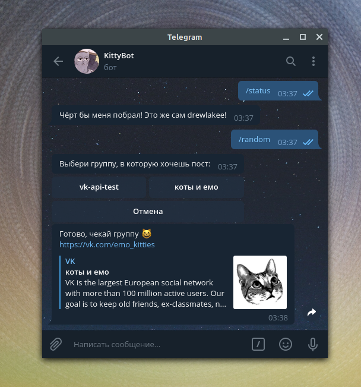

# Telegram бот, постящий контент в VK

<details>
   <summary>Примеры</summary>
   
   
   
   
</details>

#### VM аргументы:

```` 
telegram bot:
-Dhost_username=username
-Dbot_username=username
-Dbot_token=token
[-Dbot_proxy_type=type]
[-Dbot_proxy_host=ip]
[-Dbot_proxy_port=port]
[-Dbot_threads=count]

[-D...] - опционально
host_username - пользователь в telegram, от лица которого бот будет взаимодействоать с VK API
bot_proxy_type - тип протокола: HTTP, SOCKS4, SOCKS5
bot_threads - количество потоков, которые обрабатывают запросы к боту

vk api:
-Dvk_token=token
-Dvk_user_id=user_id
````

Ключ доступа получается через Implicit Flow для доступа к VK от лица пользователя.

Подробнее в [документации ВКонтакте](https://vk.com/dev/manuals).

#### Изменения:
#### v1.0.1
* Добавлен интерактивный диалог у комнды [/random](src/main/java/telegram/commands/RandomCommand.java) по выбору подобранной фотографии.